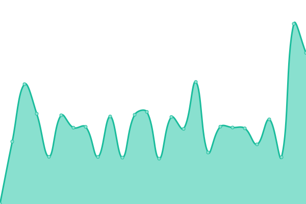

# [📈 Live Status](https://status.megamov.fr): <!--live status--> **🟧 Partial outage**

This repository contains the open-source uptime monitor and status page for [megamovnetwork](https://status.megamov.fr), powered by [Upptime](https://github.com/upptime/upptime).

With [Upptime](https://upptime.js.org), you can get your own unlimited and free uptime monitor and status page, powered entirely by a GitHub repository. We use [Issues](https://github.com/megamovnetwork/upptime/issues) as incident reports, [Actions](https://github.com/megamovnetwork/upptime/actions) as uptime monitors, and [Pages](https://status.megamov.fr) for the status page.

<!--start: status pages-->
<!-- This summary is generated by Upptime (https://github.com/upptime/upptime) -->
<!-- Do not edit this manually, your changes will be overwritten -->
<!-- prettier-ignore -->
| URL | Status | History | Response Time | Uptime |
| --- | ------ | ------- | ------------- | ------ |
|  Dedicated server D1-RBX4 | 🟩 Up | [dedicated-server-d1-rbx-4.yml](https://github.com/megamovnetwork/upptime/commits/HEAD/history/dedicated-server-d1-rbx-4.yml) | 

 809ms
     
 | 

<a href="https://status.megamov.fr/history/dedicated-server-d1-rbx-4">100.00%</a>
    

|  Node Cloud | 🟩 Up | [node-cloud.yml](https://github.com/megamovnetwork/upptime/commits/HEAD/history/node-cloud.yml) | 

 1416ms
     
 | 

<a href="https://status.megamov.fr/history/node-cloud">100.00%</a>
    

|  Node Teamspeak | 🟩 Up | [node-teamspeak.yml](https://github.com/megamovnetwork/upptime/commits/HEAD/history/node-teamspeak.yml) | 

 1400ms
     
 | 

<a href="https://status.megamov.fr/history/node-teamspeak">100.00%</a>
    

|  Node Webhosting | 🟥 Down | [node-webhosting.yml](https://github.com/megamovnetwork/upptime/commits/HEAD/history/node-webhosting.yml) | 

 452ms
     
 | 

<a href="https://status.megamov.fr/history/node-webhosting">46.70%</a>
    

|  Node Web | 🟩 Up | [node-web.yml](https://github.com/megamovnetwork/upptime/commits/HEAD/history/node-web.yml) | 

 1038ms
     
 | 

<a href="https://status.megamov.fr/history/node-web">100.00%</a>
    

<!--end: status pages-->

[**Visit our status website →**](https://status.megamov.fr)

## 📄 License

- Powered by: [Upptime](https://github.com/upptime/upptime)
- Code: [MIT](./LICENSE) © [megamovnetwork](https://status.megamov.fr)
- Data in the `./history` directory: [Open Database License](https://opendatacommons.org/licenses/odbl/1-0/)
